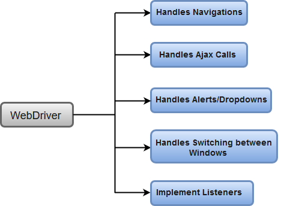

# Selenium WebDriver
Selenium WebDriver is the most important component of Selenium Tool's Suite.  
The following image will give you a fair understanding of Selenium components and the Test Automation Tools.

## Selenium WebDriver - Architecture
Selenium WebDriver API provides communication facility between languages and browsers.
The following image shows the architectural representation of Selenium WebDriver

There are four basic components of WebDriver Architecture:
* Selenium Language Bindings
* JSON Wire Protocol
* Browser Drivers
* Real Browsers

## Selenium Language Bindings / Selenium Client Libraries
Selenium Developers have built language bindings/Selenium Client Libraries in order to support   
multiple lanuages.

## JSON Wire Protocol
JSON(JavaScript Object Notation) is an open standard for exchanging data on web. It supports data   
structures like object and array.

JSON Wire protocol provides a transport mechanism to transfer data between a server and a client. 
JSON Wire Protocol provides a transport mechanism to transfer data between a server and a client.   
JSON Wire Protocol servers as an industry standard for various REST web services.

## Browser Drivers
Selenium uses drivers, specific to each browser in order to establish a secure connection with the browser   
without revealing the internal logic of browser's functionality.

The browser driver is also specific to the language used for automation such as Java, C#

**When we execute a test script using WebDriver, the following operations are performed internally.**

* HTTP request is generated and sent to the browser driver for each Selenium command.  
* The driver receives the HTTP request through HTTP server.
* HTTP Server decides all the steps to perform instructions which are executed on browser.
* Execution status is sent back to HTTP Server which is subsequently sent back to automation script.

## Browsers
Browsers supported by Selenium WebDriver:
* Internet Explorer
* Mozilla Firefox
* Google Chrome
* Safari

## Selenium WebDriver - Features
1. **Multiple Browser Support** - Selenium WebDriver supports a diverse range of web browsers such as   
Firefox, chrome, IE, Opera, Opera.
2. **Multiple Languages Support** - Selenium WebDriver supports most commonly used programming languages like   
Java, C#, JavaScript, PHP, Ruby, Pearl and Python
3. **Speed** - WebDriver performs faster as compared to other tools of Selenium Suite.
4. **Simple Commands** - Most of the the commands used in Selenium WebDriver are easy to implement. 
5. **WebDriver - Methods and Classes**
WebDriver provides multiples solutions to cope with some potential challenges in automation   
testing.
