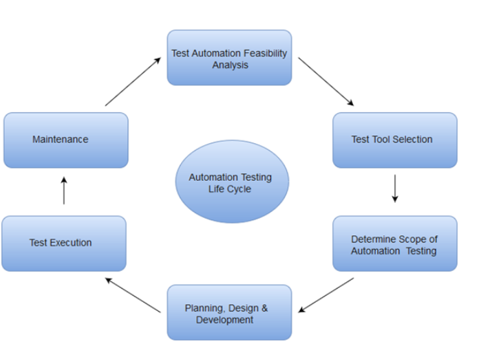

## Automation Testing
Automation testing uses the specialized tools to automate the execution of manually designed test cases without any human intervention. Automation testing tools can access the test data, controls the execution of tests and compares the actual result against the expected result. Consequently, generating detailed test reports of the system under test.

Automation Testing tools which are used for functional automation:

* Quick Test Professional, provided by HP.

* Rational Robot, provided by IBM.

* Coded UI, provided by Microsoft.

* Selenium, open source.

* Auto It, open Source.

Automation Testing tools which are used for non-functional automation:

* Load Runner, provided by HP.
* JMeter, provided by Apache.
* Burp Suite, provided by PortSwigger.
* Acunetix, provided by Acunetix.

## Automation Testing Life Cycle
