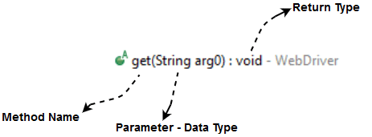

## Selenium Webdriver - Commands
Selenium commands are the set of commands that are used to run our Selenium tests.

```
one possible way to view the methods provided by WebDriver is to open the Eclipse IDE 
loaded with Selenium Webdriver jar files, create a driver object for WebDriver and press 
the dot key. It will show you all of the possible methods provided by WebDriver.
```


## Syntax exmaple

1. Method Name - To access any method of any class, we need to create an object of class 
and then all the public methods will appear for the object.

2. Parameter Name - A parameter is an argument which is passed to a method to perform some specific operation.

3. Return type - Methods can return a value or returning nothing (void). If the   
void is mentioned after the method, it means, the method is returning no value.   
If it is returning a value, then it must display the type of the value for   
e.g. getTitle(): String.

**Selenium WebDriver can be broadly classified in following categories:**
1. Browser Commands
2. Navigation Commands
3. WebElement Commands

Following are the most commonly used selenium commands in Webdriver:
1. Fetching a webpage
* Using Get method
`driver.get("www.test.com")`
* Using Navigate method
`driver.navigate().to("www.test.com")`

2. Locating forms and sending user inputs
`driver.findElement(By.id(lst-ib)).sendKeys("write your own text here")`

3. Clearing User inputs

use `clear` method to clear the user inputs from the text box.
e.g.  
```
driver.findElement(By.name("q")).clear();
```
4. Fetching text over any web element
```
driver.findElement(By.id("element567")).getText();
```

5. Performing Click event
To click on any webelement simply use click() method

```
driver.findElement(By.id("idValue")).click();
```
6. Navigating backward in browser history

```
driver.navigate().back();
```
7. Navigating forward in browser history

```
driver.navigate().forward();
```
8. Refresh/Reload a web page

```
driver.navigate().refresh();
```
9. Closing Browser
```
driver.close();
```
10. Closing browser and other all other windows associated with the driver.

```
driver.quit();
```
11. Moving between frames
```
driver.switchTo().frame("frameName");
```