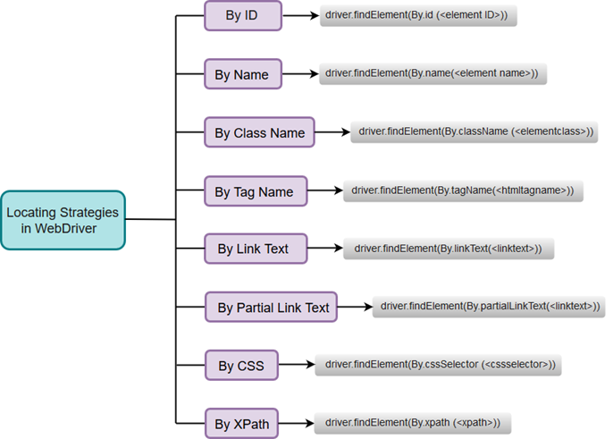

**Note** - Locating web elements in Webdriver is performed with the help of findElement() and findElements() method.

### A list of Locating Strategies used in WebDriver:
1. By ID
2. By Name
3. By Class Name
4. By Tag Name
5. By Link Text
6. By Partial Link Text
7. By CSS
8. bY XPath
