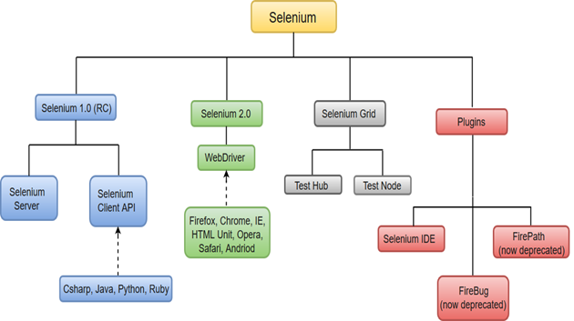
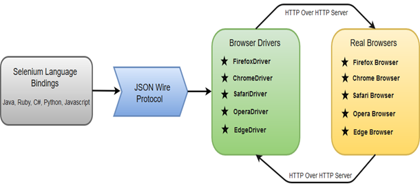

# Selenium WebDriver
Selenium WebDriver is the most important component of Selenium Tool's Suite.  
The following image will give you a fair understanding of Selenium components and the Test Automation Tools.

# Selenium WebDriver - Architecture
Selenium WebDriver API provides communication facility between languages and browsers.
The following image shows the architectural representation of Selenium WebDriver

There are four basic components of WebDriver Architecture:
* Selenium Language Bindings
* JSON Wire Protocol
* Browser Drivers
* Real Browsers