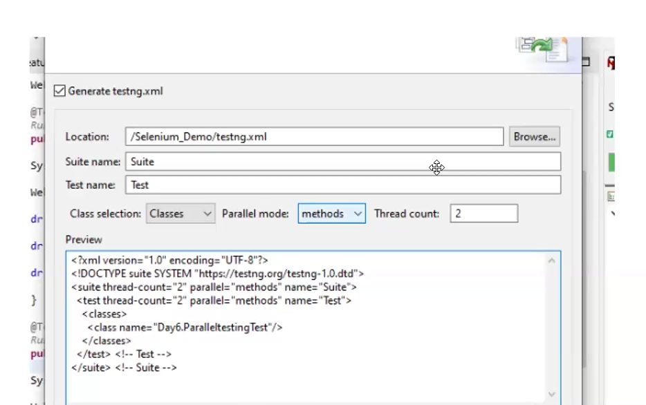
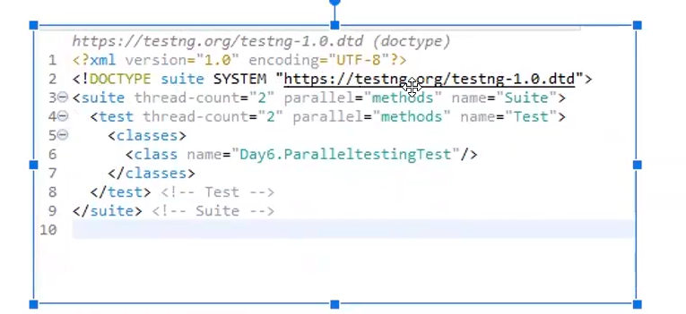

# Parallel Testing
What is Parallel Execution in TestNG?

Parallel testing is a process where multiple tests are executed simultaneously/in parallel in  
different thread processes. With respect to Selenium and TestNG, it allows you to execute  
multiple tests on different browsers, devices, environments in parallel and at the same time,  
instead of running it sequentially.  

The main purpose of running tests in parallel mode is to reduce execution time and do 
maximum environment coverage (browsers/devices/environment) in less time.  

Suppose, for an application you need to execute a sanity automation suite of 50 test cases  
in Chrome and Firefox browser. If you go with the traditional sequential flow, you need to  
execute the suite for Chrome browser first which would take 1 hr and then you need to  
execute for Firefox browser which takes another 1 hr.

So, in total you would need 2 hrs to test in both the browsers. By using a parallel
mechanism, you can run simultaneously for both the browsers in just I hr thereby reducing
the execution time by 50%.

# Steps to implement Parallel testing in TestNG .
To do so you need to first create a testing.xml file and add a parallel attribute for the
test suite with value as methods.

Executing Parallel Test Methods in TestNG

**Step 1** To create a testing.xml file, right click on the Parallel Test class and select TestNG
Convert to TestNG

**Step 2** You may select Parallel mode and ThreadCount value of your choicewhile creating
the testing.xml file or you may update it later as per the requirement change. I have
selected Parallel mode as methods and ThreadCount as 2.





**Step 3** Right click on the testing.xml file and select "Run As" -> "TestTNG Suite"]
bserve the time taken to execute both the methods in parallel mode.

* ParallelTesting.java
```
package day6;

import org.openqa.selenium.WebDriver;
import org.openqa.selenium.chrome.ChromeDriver;
import org.openqa.selenium.firefox.FirefoxDriver;
import org.testng.annotations.AfterClass;
import org.testng.annotations.Test;

import io.github.bonigarcia.wdm.WebDriverManager;

public class ParallelTesting {
	WebDriver driver;
	WebDriver driver1;
	
	@Test
	public void testChrome() throws InterruptedException {
		System.out.println("The thread ID for Chrome is " + Thread.currentThread().getId());
		WebDriverManager.chromedriver().setup();
		driver = new ChromeDriver();
		driver.get("https://www.bstackdemo.com/");
		driver.manage().window().maximize();
		Thread.sleep(2000);
	}
	
	@Test
	public void testFirefox() throws InterruptedException {
		System.out.println("The thread ID for Firefox is " + Thread.currentThread().getId());
		WebDriverManager.firefoxdriver().setup();
		driver1 = new FirefoxDriver();
		driver1.get("https://www.bstackdemo.com/");
		driver1.manage().window().maximize();
		Thread.sleep(2000);
	}
	
	@AfterClass
	public void teardown() {
		driver.close();
		driver1.close();
		driver.quit();
		driver1.quit();
	}
	
	
}

```