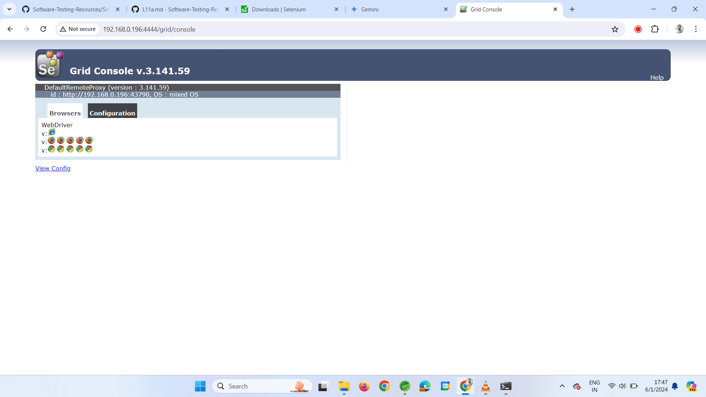

# Selenium Grid - Grid Architecture and Demo

Selenium Grid is a tool in the Selenium suite that facilitates parallel test execution by  
allowing tests to run on multiple machines or browsers concurrently, providing a  
scalable and efficient solution for distributed test automation.  

Selenium suite comprises four components.
1. SeleniuntGrid
2. Selenium IDE
3. Selenium RC
4. Selenium Webdriver

# Selenium Grid
* Selenium Grid is a feature in Selenium that allows you to run test cases in
different machines across different platforms. 

* The control of triggering the test cases is on the local machine, and when the
test cases are triggered, they are automatically executed by the remote
machine. Suppose you have 5 test cases. 
* Your local machine is running
multiple applications, so you want to run yourtest cases in a remote machine.
You need to configure the remote server so that the test cases can be
executed there.


## Hub
* A Hub is a central point or a local machine that receives all the test requests
and distributes them to the right nodes. The machine which actually triggers
the test case known as Hub.
* There can be only one hub in a selenium grid.
* The machine which is containing the hub triggers the test case, but you will
see the browser being automated on other machines.

## Node
Nodes are the selenium instances which will execute the test cases that you loaded
on the hub. 

Nodes can be launched on multiple machines with different platforms
and browsers.

* Simple Selenium Grid Architecture to setup both Hub and node in the same localhost.


Name of the Jar file is - **Selenium standalone server.jar**

With the help of this Jar file we can setup both Hub and Nodes.


 * Brief Working :
Before writing the code Process:
1. Download Selenium standalone server.
2. We have to install Hub server in our local.
3. We have to install Node server in our local.


 * In the code/Eclipse :
 1. In code, we should give the address/URL of Hub.
 2. We should specify the Desired Capabilities of the platform
 3. We should use ChromeOptions in our code.

 ## For the Hub
 1. For Hub, we need a Selenium standalone server jar file to be specified.
 2. We need to start the Hub server.

 ## For Node to execute in chrome browser:
 1. For Hub, we need a Selenium standalone server jar file to be specified.
 2. Chrome browser should be installed.
 3. Chromedriver.exe should be present in the node.
 4. We need to Register a node with Hub.(Connecting Hub with node is called Registering)

 * Implementation :
 step1 - Download selenium standalone server jar file and keep it in a folder.
 step2 - Open command prompt at the location of your selenium server jar file/change path after opening cmd.
 step3 - Hub Configuration.


# Start Selenium grid 
 type the command to install Selenium Hub:
 ```
 Java -jar selenium-server-standalone-3.141.59.jar -role hub (include .jar in the command)
```

```
Command to Install node server

java -Dwebdriver.chrome.driver="C:\Users\rudre\Downloads\seleniumgrid\chromedriver.exe" -jar selenium-server-standalone-3.141.59.jar -role node -hub http://192.168.0.196:4444/grid/register/

```

## The following message will be displayed in your cmd.


console of selenium grid




* gridtest.java

```
package grid;

import java.net.URL;
import java.nio.charset.MalformedInputException;

import org.openqa.selenium.Platform;
import org.openqa.selenium.WebDriver;
import org.openqa.selenium.chrome.ChromeOptions;
import org.openqa.selenium.remote.DesiredCapabilities;
import org.openqa.selenium.remote.RemoteWebDriver;

public class gridtest {

	public static void main(String[] args) throws MalformedInputException {
		// TODO Auto-generated method stub
		//Step 1 - Create object of Desired Capabilities
		DesiredCapabilities des = new DesiredCapabilities();
		
		// Step 2 - Through desired capabilities we set the browser name and platform name
		des.setBrowserName("chrome");
		des.setPlatform(Platform.WINDOWS);
		
		// Step 3 - I have to create object of chromeoptions class
		ChromeOptions op = new ChromeOptions();
		
		// Step 4 - Merging ChromeOptions with the Desired Capabilities
		op.merge(des);
		
		// Step 5 - Store the HubURL in a string
		String HubURL = "http://192.168.0.196:4444/wd/hub";
		
		try {
			
			// Step 6 - Invoke the browser with RemoteWebDriver and pass the HubURL
			// and chromeoptions instance using URL object
			
			WebDriver driver = new RemoteWebDriver(new URL(HubURL),op);
			
			driver.get("https://www.amazon.in/");
			System.out.println(driver.getTitle());
			
		} catch (Exception e) {
			// TODO: handle exception
		}
		
	}

}
```