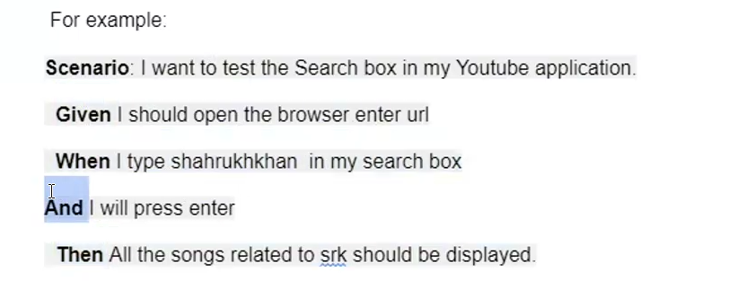

# Introduction to BDD-Cucumber
Approach to Develop, Test, maintain, Deliver the software.

BDD - Behavioral Driven Development.

Other approaches:
TDD - Test Driven Development.  

## What is BDD?
BDD is a way for software teams to work that closes the gap between **business
people** and **technical people** by:
* Encouraging collaboration across roles to build shared understanding of
the problem to be solved
* Working in rapid, small iterations to increase feedback and the flow of
value
* Producing system documentation that is automatically checked against
the system's behaviour

We do this by focusing collaborative work around concrete, real-world examples that  
illustrate how we want the system to behave. We use those examples to guide us  
from concept through to implementation, in a process of continuous collaboration.  


## What is Cucumber?
It is a framework keeping in minds about 3 Amigos.(Testers, Developers and Business Analyst/Product owner)

Cucumber reads executable specifications written in plain text and validates that the
software does what those specifications say. The specifications consists of multiple examples,  
or scenarios.  

There are 3 Main Components of Cucumber Framework.
1. **Feature Files** - Files that are written in Plain English Format. These are also called as Gherkin files.
It makes use of Keywords. And those come from Gherkin language.
**Gherkin** Language/Format that is used to write feature files.

2. **Step Definitions** - These are the Subsequent Java Classes that is used to convert feature files    
into Java selenium Code.

This acts like a translator which translate English language into Java. 

3. **Runner file** - Runner file takes the path of feature file and Step definition and executes the code.

For example:
```
Scenario: Breaker guesses a word  
Given the Maker has chosen a word

When the Breaker makes a guess

Then the Maker is asked to score.
```



```
Scenario: I want to test the Amazon Fresh Feature in Amazon.in
Given : Open the browser and enter Amazon.in
AND make sure that you are using chrome browser
When Click on Fresh Link in bar menu
Then The Amazon Fresh page should be displayed.
AND it should also display the SBI Card Advertisement
```

Each scenario is a list of steps for Cucumber to work through. Cucumber verifies   
that the software confirms with the specification and generates a report   
indication ✔️ success or ❌ failure for each scenario.


## Workflow:
1. Write Scenarios:
* Collaboratively write scenarios in Gherkin to describe the expected behavior of the application.
2. Implement Step Definitions:
* Implement the step definitions in the programming language of your choice (e.g., Java, Ruby, JavaScript)   
to map Gherkin steps to actual code.
3. Run Tests:
* Run the tests to validate the application’s behavior against the defined scenarios.
4. Refactor and Iterate:
* Refactor the code and scenarios as needed, continuously improving the application and its test coverage.


BDD-Cucumber bridges the gap between technical and non-technical team members, fostering a collaborative   
environment that leads to the development of high-quality software.

loginStpes.java
```
package stepdefinitions;

import io.cucumber.java.en.*;

public class LoginSteps {

    @Given("the user is on the login page")
    public void the_user_is_on_the_login_page() {
        // Code to navigate to the login page
        System.out.println("User is on the login page");
    }

    @When("the user enters a valid username and password")
    public void the_user_enters_a_valid_username_and_password() {
        // Code to enter valid username and password
        System.out.println("User enters valid username and password");
    }

    @When("the user clicks the login button")
    public void the_user_clicks_the_login_button() {
        // Code to click the login button
        System.out.println("User clicks the login button");
    }

    @Then("the user should be redirected to the dashboard page")
    public void the_user_should_be_redirected_to_the_dashboard_page() {
        // Code to verify redirection to dashboard
        System.out.println("User is redirected to the dashboard page");
    }

    @When("the user enters an invalid username or password")
    public void the_user_enters_an_invalid_username_or_password() {
        // Code to enter invalid username or password
        System.out.println("User enters invalid username or password");
    }

    @Then("the user should see an error message")
    public void the_user_should_see_an_error_message() {
        // Code to verify the error message
        System.out.println("User sees an error message");
    }
}

```


