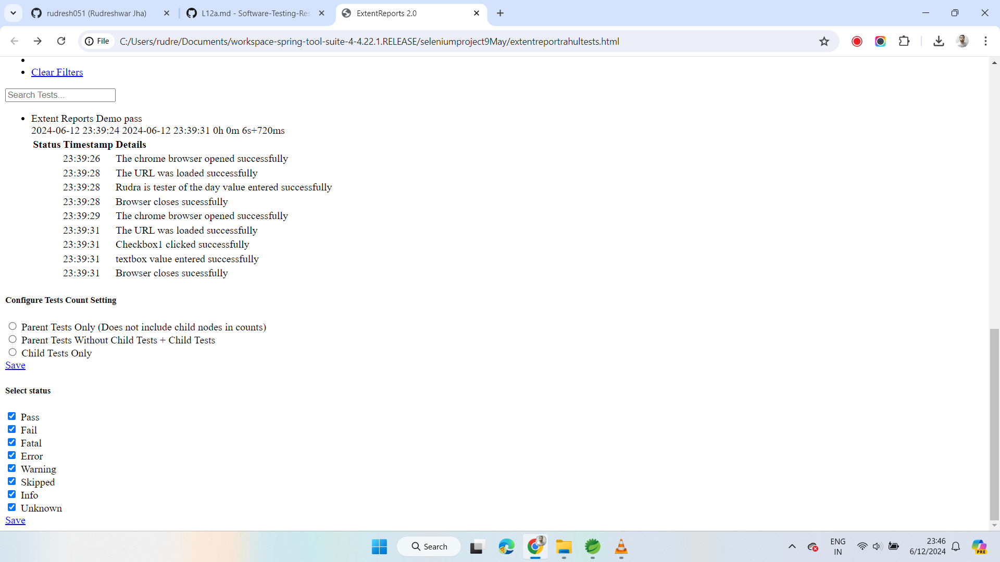

# Extent Reports

**What are Extent Reports?**

Extent Reports is an open-source reporting library useful for test automation.  
It can be easily integrated with major testing frameworks like JUnit, NUnit, TestNG etc.

These reports are HTML documents that depict results as pie charts.

They also allow the generation of custom logs, snapshots, and other customized details.

Once an automated test script runs successfully, testers need to generate a test  
execution report. While provide a default report, they do not provide the details.  

Using Extent Reports in Selenium  
Extent Reports in Selenium contain two major, frequently used classes:  

* ExtentReports class
* ExtentTest class

## Dependency

* https://mvnrepository.com/artifact/com.aventstack/extentreports

Example  

```java
<!-- https://mvnrepository.com/artifact/com.aventstack/extentreports -->
<dependency>
    <groupId>com.aventstack</groupId>
    <artifactId>extentreports</artifactId>
    <version>5.1.2</version>
</dependency>
```

**Syntax**  

```java
ExtentReports reports = new ExtentReports("Path of directory to store the resultant HTML file", true/false);

ExtentTest test = reports.startTest("TestName");

```

The ExtentReports class generates HTML reports based on a path specified by the tester. Based on the Boolean flag,
the existing  report has to be overwritten or a new report must be generated. "True" is the default value, meaning
that all existing data will be overwritten.

The ExtentTest class logs test steps onto the previously generated HTML report.  
Both classes can be used with the following built-in methods:

**startTest:** : Executes preconditions of a test case
with this method, we are telling extentReport to start the reporting.

**endTest** : Executes postconditions of a test case
With this method, we are telling extentReport to stop the reporting.

**Log** : Logs the status of each test step onto the HTML report being generated.

**Flush:** Erases any previous data on a relevant report and creates a whole new report.

A Test Status can be indicated by the following values:  
PASS  
FAIL  
SKIP  
INFO  

### Extent Report

```java
package day9;

import org.openqa.selenium.By;
import org.openqa.selenium.WebDriver;
import org.openqa.selenium.WebElement;
import org.openqa.selenium.chrome.ChromeDriver;
import org.testng.annotations.AfterClass;
import org.testng.annotations.AfterMethod;
import org.testng.annotations.BeforeClass;
import org.testng.annotations.BeforeMethod;
import org.testng.annotations.Test;

import com.relevantcodes.extentreports.ExtentReports;
import com.relevantcodes.extentreports.ExtentTest;
import com.relevantcodes.extentreports.LogStatus;

public class ExtentReport {
 
 WebDriver driver;
 ExtentTest test;
 ExtentReports report;
 
 // What is Before class
 @BeforeClass
 public void reportsetup() {
  // Step 1 - Creating object of ExtentReport
  //C:\\Users\\rudre\\Documents\\workspace-spring-tool-suite-4-4.22.1.RELEASE\\seleniumproject9May\\src\\main\\extentreport.html
  report = new ExtentReports(System.getProperty("user.dir")+"\\extentreportrahultests.html");
  
  // Step 2 - We need to start the test using report - reference variable ExtentReports class.
   test = report.startTest("Extent Reports Demo");
 }
 
 @BeforeMethod(alwaysRun = true)
 public void setup() {
  System.setProperty("webdriver.chrome.driver", "C:\\Users\\rudre\\Downloads\\chromedriver-win64-12June\\chromedriver-win64\\chromedriver.exe");

  driver = new ChromeDriver();
  test.log(LogStatus.PASS, "The chrome browser opened successfully");

  driver.get("https://rahulshettyacademy.com/AutomationPractice");
  
  // adding logs
  test.log(LogStatus.PASS, "The URL was loaded successfully");
 
 }
 
 @Test(groups= {"smoke"})
 public void textboxTest() {
  WebElement option1 = driver.findElement(By.cssSelector("input[name='checkBoxOption1']"));
  option1.click();
  test.log(LogStatus.PASS, "Checkbox1 clicked successfully");
  // interact with textbox - enter text using sendkeys
  WebElement textbox1 = driver.findElement(By.id("autocomplete"));
  textbox1.sendKeys("Hello Selenium");
  test.log(LogStatus.PASS, "textbox value entered successfully");
 }
 
 @Test(groups= {"smoke"})
 public void SendkeysTest() {
  String actual = "Rudra is tester of the day";
  WebElement textbox = driver.findElement(By.id("autocomplete"));
  textbox.sendKeys("Rudra is tester of the day");
  
  String text = textbox.getText();
  System.out.println(text);
  test.log(LogStatus.PASS, "Rudra is tester of the day value entered successfully");
 }
 
 @AfterMethod(alwaysRun = true)
 public void teardown() {
  driver.close();
  test.log(LogStatus.PASS, "Browser closes sucessfully");
 }
 
 @AfterClass
 public void flush() {
  // In end test we need to provide the ExtentTest reference variable
  report.endTest(test);
  report.flush(); // flush will clear out out all the previous details and it 
  // create a new report for the freshly executed report
 }
 
 
}


```

Report Screenshot

