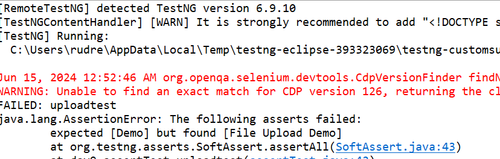

# Assertions

**Assertions using TestNG**

* What are Assertions in TestNG?  
Assertions in are a way to verify that the expected result and the  
actual result matched or not. 
If we could decide the outcome on different small  
methods using assertions in our test case, we can determine whether our test  
failed or passed overall.  

Defect - When there is a deviation between your actual result from your expected result.

With assert we are checking actual result in comparison with your Expected result.

The word Assert means to state a fact or belief confidently or forcefully.  

In Selenium, Asserts are validations or checkpoints for an application.  

Assertions state confidently that application behavior is working as  
expected. Asserts in Selenium validate the automated test cases that help  
testers understand if tests have passed or failed.  

Types of Assertions - 
* Hard Assertions
* Soft Assertions (Verify Method)


The word **Assert** means to state a fact or belief confidently or forcefully.   
In Selenium, Asserts are validations or checkpoints for an application.

Assertions state confidently that application behavior is working as expected. 

Asserts in Selenium validate the automated test cases that help testers understand   
if tests have passed or failed.


# Hard Assertions 
Hard Assertions are ones in which test execution is aborted if the test does not meet the assertion   
condition. 

The test case is marked as failed. 

In case of an assertion error, it will throw the   
**"java.lang.AssertionError"** exception.

**Syntax for TestNG Assertions:**
Although there are many methods for assertions(later in this article), the generic syntax is:

AssertMethod(actual, expected)


**The parameter as you see contains three values:**

**Actual:** The actual value that the tester gets like if the tester's assertion is on the   
title of the page then what was the actual title of the page goes here.

**Expected** - The value that you expect like if the tester's assertion is on the title of   
the page then what value of title do you expect goes here.

```
@Test(priority = -1)
public void OpenBrowser(){
    
    driver.get("https://www.demoqa.com");
    String expectedTitle = "Free QA Automation Tools For Everyone";
    String originalTitle = driver.getTitle();
    Assert.assertEquals(originalTitle, expectedTitle);
}
```

## Hard Assert example1

```
package day9;

import org.openqa.selenium.By;
import org.openqa.selenium.WebDriver;
import org.openqa.selenium.WebElement;
import org.openqa.selenium.chrome.ChromeDriver;
import org.testng.annotations.Test;

public class assertTest {
	@Test
	public void uploadtest() {
		System.setProperty("webdriver.chrome.driver", "C:\\Users\\rudre\\Downloads\\chromedriver-win64-12June\\chromedriver-win64\\chromedriver.exe");
		WebDriver driver = new ChromeDriver();
		driver.get("https://demo.guru99.com/test/upload");
		
		String expectedURL = "https://demo.guru99.com/test/upload";
		String actualURL = driver.getCurrentUrl();
		
		org.testng.Assert.assertEquals(false, false);
		
		String actualtitle = driver.getTitle();
		
		String expected = "File Upload Demo";
		
		// Hard asserts - We are validating title of the our page
		org.testng.Assert.assertEquals(actualtitle,expected);
		
		
		// Step 1 - Store the Locator of the upload web element.
		WebElement upload_button = driver.findElement(By.id("uploadfile_0"));
		
		// Step 2 - Use sendkeys to send the file path of the uploading file.(Without performing click)
		upload_button.sendKeys("C:\\Users\\rudre\\OneDrive\\Documents\\screenshot.png");
		driver.findElement(By.id("terms")).click();
		driver.findElement(By.id("submitbutton")).click();
		
		
	}
}


```

## Hart Assert example 2

```
package day9;

import java.util.List;

import org.junit.Assert;
import org.openqa.selenium.By;
import org.openqa.selenium.WebDriver;
import org.openqa.selenium.WebElement;
import org.openqa.selenium.chrome.ChromeDriver;
import org.testng.annotations.BeforeMethod;
import org.testng.annotations.Test;

public class AssertTest1 {
	WebDriver driver;
	
	@BeforeMethod(alwaysRun = true)
	public void setup() {
		System.setProperty("webdriver.chrome.driver", "C:\\Users\\rudre\\Downloads\\chromedriver-win64-12June\\chromedriver-win64\\chromedriver.exe");
		driver = new ChromeDriver();
		driver.get("https://rahulshettyacademy.com/AutomationPractice/");
	}
	
	@Test
	public void checkboxtest() {
		 List<WebElement> checkboxes = driver.findElements(By.xpath("//input[@type='checkbox']"));
		
		for(WebElement check : checkboxes) {
			boolean enablestatus = check.isEnabled();
			Assert.assertTrue(enablestatus);
			
			check.click();
			boolean status = check.isSelected();
			Assert.assertTrue(status);
		}
		
		
	}
	
}

```

### Soft Assert Example 1
```
package day9;

import org.openqa.selenium.By;
import org.openqa.selenium.WebDriver;
import org.openqa.selenium.WebElement;
import org.openqa.selenium.chrome.ChromeDriver;
import org.testng.annotations.Test;
import org.testng.asserts.SoftAssert;

public class assertTest {
	@Test
	public void uploadtest() {
		System.setProperty("webdriver.chrome.driver", "C:\\Users\\rudre\\Downloads\\chromedriver-win64-12June\\chromedriver-win64\\chromedriver.exe");
		WebDriver driver = new ChromeDriver();
		driver.get("https://demo.guru99.com/test/upload");
		
		String expectedURL = "https://demo.guru99.com/test/upload";
		String actualURL = driver.getCurrentUrl();
//		org.testng.Assert.assertEquals(false, false);
		
		
		String actualtitle = driver.getTitle();
		String expected = "Demo";
		// Hard asserts - We are validating title of the our page
//		org.testng.Assert.assertEquals(actualtitle,expected);
		
		
		// To use Soft Assert we need to create an object of SoftAssert class.
		SoftAssert sa = new SoftAssert();
		sa.assertEquals(actualtitle, expected);
		
		
		// Step 1 - Store the Locator of the upload web element.
		WebElement upload_button = driver.findElement(By.id("uploadfile_0"));
		
		// Step 2 - Use sendkeys to send the file path of the uploading file.(Without performing click)
		upload_button.sendKeys("C:\\Users\\rudre\\OneDrive\\Documents\\screenshot.png");
		driver.findElement(By.id("terms")).click();
		driver.findElement(By.id("submitbutton")).click();
		
		// By using assertall() method we will get the results in console
		sa.assertAll();
		
		
	}
}

```



### Soft Assert Example 2

```
package day9;

import java.util.List;

import org.openqa.selenium.By;
import org.openqa.selenium.WebDriver;
import org.openqa.selenium.WebElement;
import org.openqa.selenium.chrome.ChromeDriver;
import org.testng.annotations.BeforeMethod;
import org.testng.annotations.Test;
import org.testng.asserts.SoftAssert;

public class SoftAssertTest2 {
WebDriver driver;
	
	@BeforeMethod(alwaysRun = true)
	public void setup() {
		System.setProperty("webdriver.chrome.driver", "C:\\Users\\rudre\\Downloads\\chromedriver-win64-12June\\chromedriver-win64\\chromedriver.exe");
		driver = new ChromeDriver();
		driver.get("https://rahulshettyacademy.com/AutomationPractice/");
	}
	
	@Test
	public void checkboxtest() {
		List<WebElement> checkboxes = driver.findElements(By.xpath("//input[@type='checkbox']"));
		
		SoftAssert sa = new SoftAssert(); 
		 
		for(WebElement check : checkboxes) {
			boolean enablestatus = check.isEnabled();
			sa.assertTrue(enablestatus);
			check.click();
			boolean status = check.isSelected();
			sa.assertTrue(status);
			
		}
		
		
	}
}
```