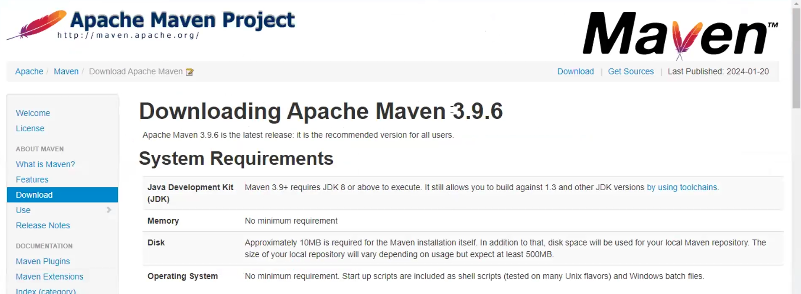

# Maven

Maven is a Build Management tool - used to build the code.

Features of Maven - 
1. **Dependencies** - We can easily mention Dependencies through Pom.xml

2. File Structure - src/test/java, src/main/java, src/main/resources/, src/test/resources

3. Build Management - With pom.xml we can build the software.

4. **Test the software with pom.xml**

5. We can integrate maven with Jenkins, Github for automating the execution process.


## Maven Build Life cycle

A Build Lifecycle is Made up of Phases

Each of these build lifecycles is defined by a different list of build phases, wherein a  
build phase represents a stage in the lifecycle.

For example, the default lifecycle comprises of the following phases (for a complete  
list of the lifecycle phases, refer to the Lifecycle Reference):  

* validate - validate the project is correct and all necessary information is available.  

* compile - compile the source code of the project

* test - test the compiled source code using a suitable unit testing framework. These
tests should not require the code be packaged or deployed

* Package -  take the compiled code and package it in its distributable format, such as
a JAR.

* verify - run any checks on results of integration tests to ensure quality criteria are
met.

* install - install the package into the local machine, for use as a dependency in
other projects locally

* deploy - done in the build environment, copies the final package to the remote
repository for sharing with other developers and projects.


* Add both maven surefire plugin and maven compiler plugin in plugins section.  


* Maven Surefire Plugin
Maven Surefire Plugin
Requirements: Maven 3.2.5 and JDK 1.8 or higher.

The Surefire Plugin is used during the test phase of the build lifecycle to execute   
the unit tests of an application. It generates reports in two different file formats:

Plain text files (*.txt)
XML files (*.xml)


* Maven compiler Plugin

Apache Maven Compiler Plugin
The Compiler Plugin is used to compile the sources of your project. Since 3.0, the default compiler   
is javax.tools.JavaCompiler (if you are using java 1.6) and is used to compile Java sources. If you   
want to force the plugin using javac, you must configure the plugin option forceJavacCompilerUse. 


## Add the following plugin the project


```
pom.xml

<project xmlns="https://maven.apache.org/POM/4.0.0" xmlns:xsi="https://www.w3.org/2001/XMLSchema-instance" xsi:schemaLocation="http://maven.apache.org/POM/4.0.0 https://maven.apache.org/xsd/maven-4.0.0.xsd">
  <modelVersion>4.0.0</modelVersion>
  <groupId>sdet</groupId>
  <artifactId>cucumberTestng8thJune</artifactId>
  <version>0.0.1-SNAPSHOT</version>
  <properties>
	<maven.compiler.source>1.8</maven.compiler.source>
	<maven.compiler.target>1.8</maven.compiler.target>
  </properties>
  <build>
	<pluginManagement>
		<plugins>
			<plugin>
				<groupId>org.apache.maven.plugins</groupId>
				<artifactId>maven-surefire-plugin</artifactId>
				<version>3.0.0-M5</version>
				<configuration>
					<includes>
						<exclude>
							**/*TestRunner.java
						</exclude>
					</includes>
				</configuration>
			</plugin>
			<plugin>
				<groupId>org.apache.maven.plugins</groupId>
				<artifactId>maven-compiler-plugin</artifactId>
				<version>3.10.1</version>
			</plugin>
		</plugins>
	</pluginManagement>
  </build>
  
  
  <dependencies>
	<!-- https://mvnrepository.com/artifact/io.cucumber/cucumber-java -->
	<dependency>
	    <groupId>io.cucumber</groupId>
	    <artifactId>cucumber-java</artifactId>
	    <version>6.11.0</version>
	</dependency>
	<!-- https://mvnrepository.com/artifact/org.seleniumhq.selenium/selenium-java -->
	<dependency>
	    <groupId>org.seleniumhq.selenium</groupId>
	    <artifactId>selenium-java</artifactId>
	    <version>4.10.0</version>
	</dependency>
	<!-- https://mvnrepository.com/artifact/io.cucumber/cucumber-testng -->
	<dependency>
	    <groupId>io.cucumber</groupId>
	    <artifactId>cucumber-t estng</artifactId>
	    <version>6.11.0</version>
	</dependency>
  </dependencies>
</project>
```
## Steps 
1. Download Maven => Select binary zip file
https://maven.apache.org/download.cgi



2. Add path in Environment variables

3. Check mvn --version in command prompt
4. Click on project name and run as => maven test
5. Navigate to project path by System Explorer
6. In CMD `mvn test`