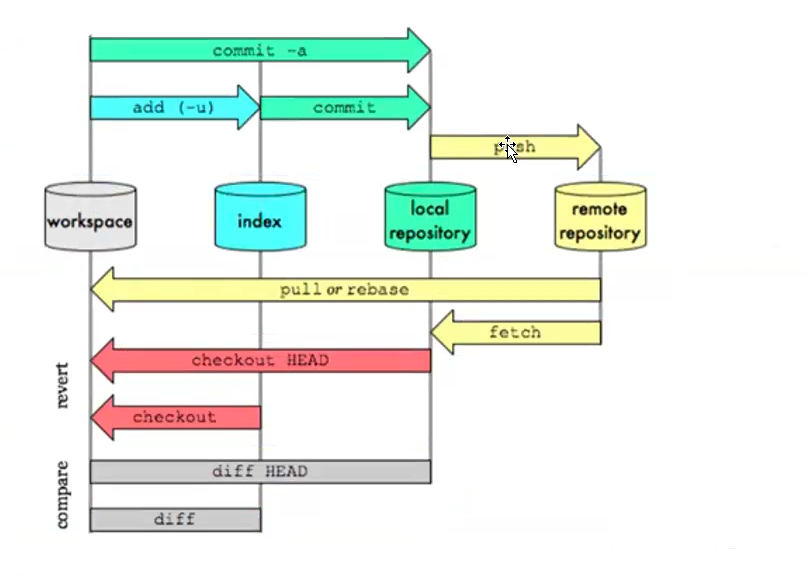
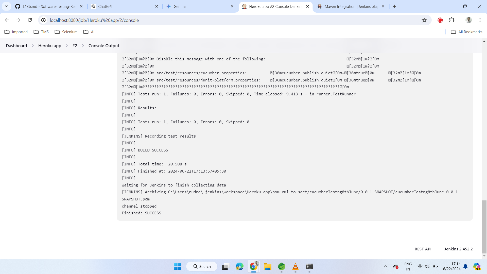

# GitHub workflow and Architecture.


# Introduction to CI-CD Jenkins & Integration with Selenium

Continuous Integration - Continuous Delivery, Continuous testing.

Jenkins is a CI-CD-CT tool.

Developers make changes the code, they will push it to GitHub.
Jenkins senses the changes in GitHub.

**WebHooks** - It helps Jenkins to detect the changes made by the developer.   
It will automatically deploy the code by itself.


Integration - Connection between different systems.

Continuous connection between developers, testers, DevOps and other teams.  

Automatically deploy, it also triggers automation testing code for execution.

Jenkins is a well-known open-source DevOps tool used in many   organizations CI/CD pipelines. Selenium is a popular open-source   automation tool for testing websites

**What is Jenkins?**
Jenkins is a self-contained, open-source automation server that can be   used to automate all sorts of tasks related to building, testing, and   delivering or deploying software.  

### Key Features
1. Extensibility: Jenkins supports a wide range of plugins, allowing users to extend its capabilities and integrate with various tools and platforms, such as Git, Maven, Docker, and Kubernetes.

2. Easy Installation and Configuration: Jenkins is relatively easy to install and configure, making it accessible to both small teams and large organizations.

3. Distributed Builds: Jenkins can distribute build tasks across multiple machines, improving performance and scalability.

4. Pipeline as Code: Jenkins supports defining build and deployment pipelines as code using its Pipeline DSL (Domain-Specific Language), making it easy to version control and manage complex workflows.

5. Community Support: Being open-source, Jenkins has a large and active community that contributes to its development and provides support.

**What is Continuous Integration?**
Continuous integration is the process of continuously checking-in the   developer's code into a version control system and triggering the build 
to check and identify bugs in the written code.  (Triggering the Automation scripts)

**What is Jenkins Pipeline? What is a Cl CD pipeline?**
The pipeline can be defined as the suite of plugins supporting the implementation and integration of continuous delivery pipelines in Jenkins.

Continuous integration or continuous delivery pipeline consists of build, deploy, test, release pipeline.

The pipeline feature saves a lot of time and error in maintaining the builds. Basically, a pipeline is a group of build jobs that are chained and integrated in sequence.

Whenever you change your code, Jenkins can automatically perform your Selenium tests and then deploy your code to a new environment if the tests pass.

**Poll SCM**
Jenkins allows you to set a time and date for executing your tests.

The Test Reports and performance logs can be saved for future reference.  

Jenkins can be used in a continuous integration setup with Maven to create and test.  

## Jenkins Installed
1. Make sure Jenkins is installed on your machine. You can download Jenkins from
https://jenkins.io/download/and follow the installation instructions.

java -jar jenkins.war

* ensure to have java 17 or 21
2. Navigate to tools and add path for Git, Maven and Java
3. Install plugins for Git and Mavan


* Check branch name if getting error
```
Started by user admin
Running as SYSTEM
Building in workspace C:\Users\rudre\.jenkins\workspace\Heroku
The recommended git tool is: NONE
using credential b8fce613-55e0-41f5-a2c2-092e23f00141
Cloning the remote Git repository
Cloning repository https://github.com/rudresh051/SeleniumProjects.git
 > C:\Program Files\Git\cmd\git.exe init C:\Users\rudre\.jenkins\workspace\Heroku # timeout=10
Fetching upstream changes from https://github.com/rudresh051/SeleniumProjects.git
 > C:\Program Files\Git\cmd\git.exe --version # timeout=10
 > git --version # 'git version 2.37.1.windows.1'
using GIT_ASKPASS to set credentials 
 > C:\Program Files\Git\cmd\git.exe fetch --tags --force --progress -- https://github.com/rudresh051/SeleniumProjects.git +refs/heads/*:refs/remotes/origin/* # timeout=10
 > C:\Program Files\Git\cmd\git.exe config remote.origin.url https://github.com/rudresh051/SeleniumProjects.git # timeout=10
 > C:\Program Files\Git\cmd\git.exe config --add remote.origin.fetch +refs/heads/*:refs/remotes/origin/* # timeout=10
Avoid second fetch
 > C:\Program Files\Git\cmd\git.exe rev-parse "refs/remotes/origin/master^{commit}" # timeout=10
 > C:\Program Files\Git\cmd\git.exe rev-parse "origin/master^{commit}" # timeout=10
ERROR: Couldn't find any revision to build. Verify the repository and branch configuration for this job.
Finished: FAILURE

```


* Change branch name to blank or main

