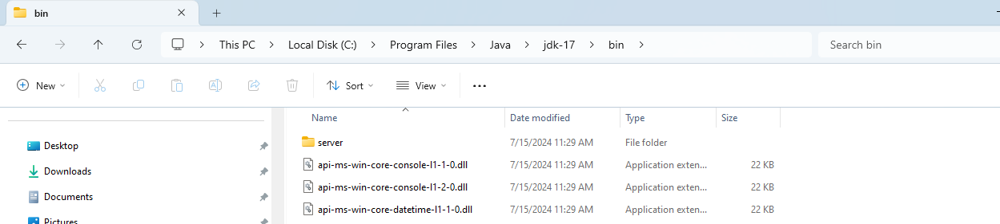
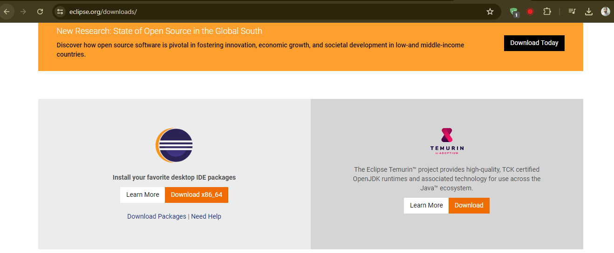
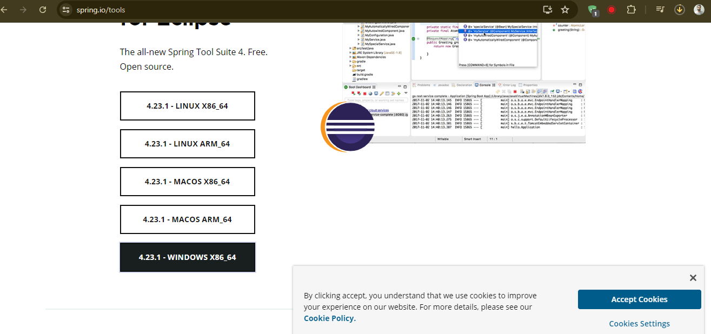
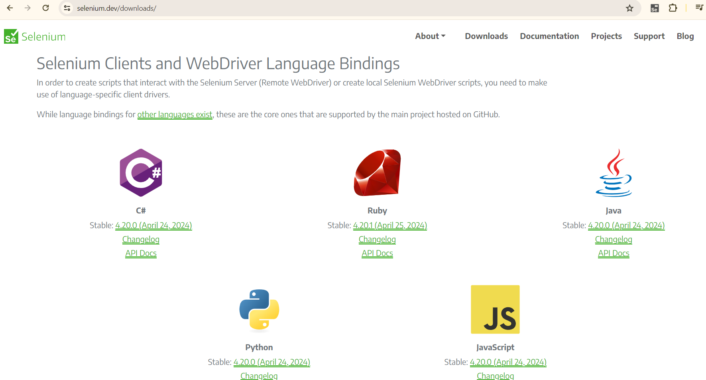
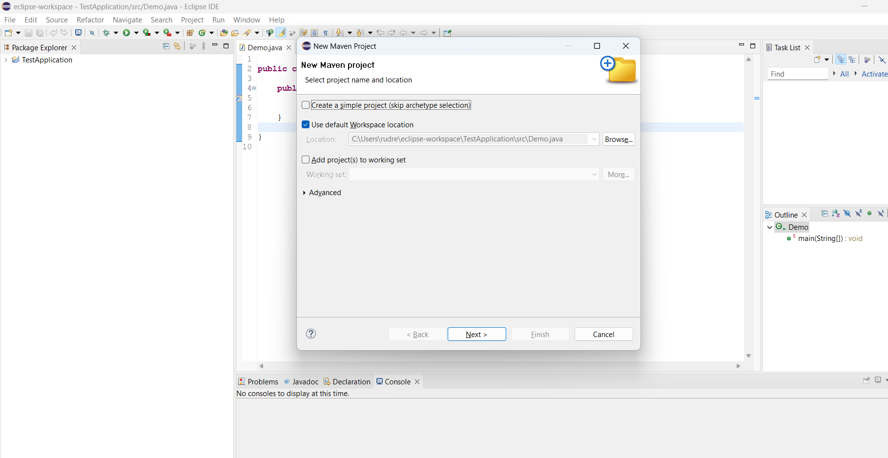
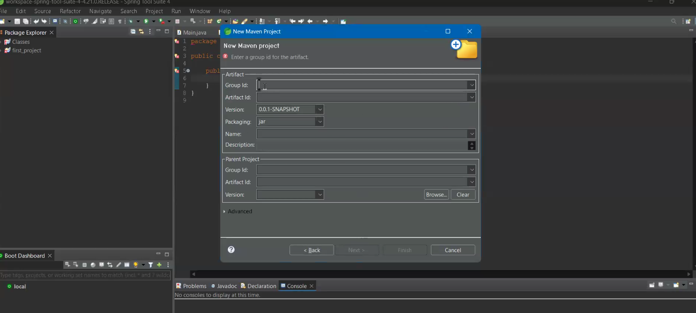
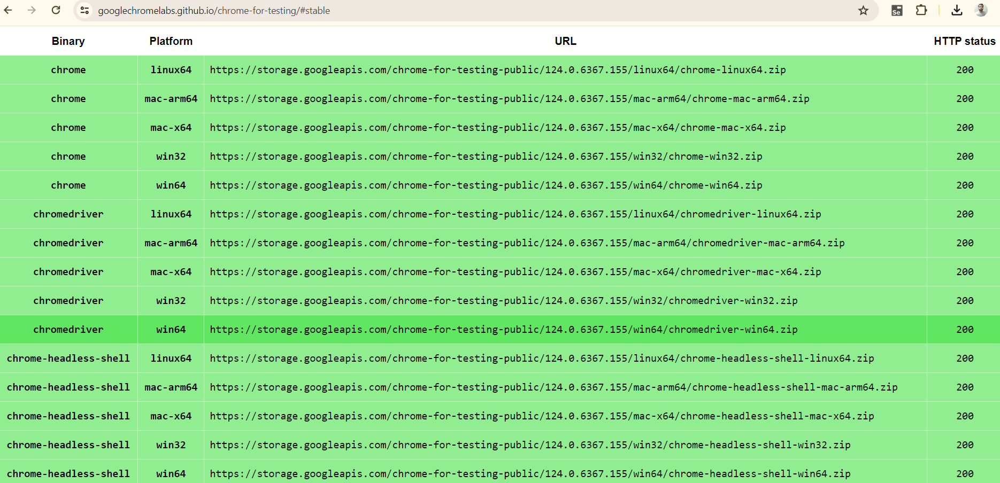
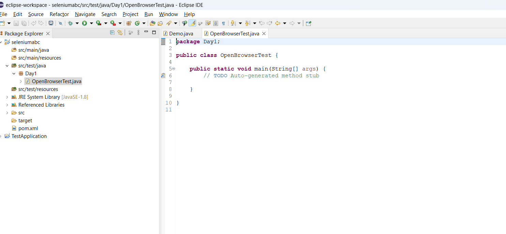

# Introduction on Selenium
Selenium is an open-source framework for automated browser testing and web application automation offering   
suite of tools to interact with web browsers programmatically

## Different Selenium components
Selenium comprises four components:
1. Selenium IDE
2. Selenium RC
3. Selenium WebDriver
4. Selenium Grid

## 1. Selenium IDE
* Selenium IDE(Integrated Development Environment) is a tool used for automated testing of   
web applications.
* A browser extension for recording and replay of interactions with a web application.
* With Selenium IDE, you can record user interactions like clicks, typing text, selecting   
options from dropdown, etc., and then replay them to perform automated tesing.
* It generates test scripts in various programming languages such as Java, Python, C#, etc.,   
which can be further customized and enhanced to suit specific testing needs.
* Selenium IDE is particularly useful for quick test prototyping, creating simple automated tests,   
and for those who are new to automated testing or programming, as it provides a simple and intuitive   
interface for test creation.
* However, for more complex testing scenarios and larger test suites, testers often use Selenium WebDriver,   
which offers more flexibility and control over the testing process.
It works only for chrome and firefox
```
Q. What are the things that cannot be automated with selenium IDE

A. While Selenium IDE is a powerful tool for automating many web interactions, there are certain   
limitations and scenarios where it many not be suitable.
Here is a complex example that illustrates some of these limitations:
Let's say you're testing a web application that involves complex interactions with elements that are   
dynamically generated or heavily reliant on JavaScript frameworks like React or Angular. One such scenario   
could involve testing a multi-step form that dynamically loads new fields based on user input.

1. Dynamic Element Identification - Selenium IDE relies on XPath or CSS selectors to locate elements on a 
web page. However, if the elements you need to interact with are dynamically generated and their attributes 
are frequently changing, it can be challenging to create reliable locators.

2. Asynchronous Actions - If the application performs asynchronous actions, such as making AJAX requests or 
waiting for elements to appear after a certain event, Selenium IDE may not handle these scenarios effectively. 
It may not have built-in mechanisms to wait for asynchronous processes to complete before proceeding 
with the test.

3. Complex Assertions and Verifications - While Selenium IDE allows for basic assertions like verifying text   
or element presence, it may not support more complex verification scenarios. For example, verifying the state   
of multiple elements simultaneously or comparing dynamic data against expected values might require custom code   
that goes beyond what Selenium IDE offers.

4. Data-Driven Testing - Selenium IDE may not provide robust support for data-driven testing, 
where test cases are executed with different sets of input data. Implementing data-driven testing   
often requires scripting and external data sources, which might be beyond the capabilities of Selenium   
IDE's interface.

5. Integration with External Systems - If your testing workflow involves interacting with external systems   
like databases, APIs, or other applications, Selenium IDE may not have built-in features for seamless 
integration with these systems.

To handle such complex scenarios, testers often resort to using Selenium WebDriver directly with programming 
languages like Java, Python, or JavaScript. WebDriver provides more flexibility and control over the testing 
process, allowing testers to implement custom logic, handle dynamic elements, and integrate with external 
systems as needed. Additionally, frameworks like TestNG or JUnit can be used to enhance test organization, 
data-driven testing, and reporting capabilities.
```

## 2. Selenium RC ( Remote Control)
It was the predecessor to WebDriver providing a server-based architecture for automated web testing   
but is now deprecated in favor of WebDriver.

* Selenium RC (Remote Control) was one of the earlier(old) versions of Selenium, used for automating web   
browsers for testing purposes. It allowed testers to write automated tests in various programming   
languages, such as Java, Python, C#, etc., by providing a client-server architecture.

* How Selenium RC worked?
* What were the drawbacks of Selenium RC?

## 3. Selenium Grid
* Selenium Grid is a tool used in Selenium testing that enables **parallel test execution** across multiple machines  
and browsers.
* It allows testers to distribute test execution across a network of machines (referred to as "nodes"),   
thereby reducing test execution time and increasing efficiency.

**Here's how Selenium Grid works:**
```
1. **Hub-Node Architecture:** Selenium Grid follows a hub-node architecture. The hub acts as a central point 
that controls the test execution, while nodes are instances of browsers running on different machines.

2. **Hub:** The hub is responsible for receiving test requests from clients, such as test scripts written in 
Selenium WebDriver, and distributing them to available nodes for execution. It manages the allocation of 
test sessions to nodes based on predefined criteria.

3. **Nodes:** Nodes are machines (physical or virtual) that host different browser environments for test execution. 
Each node registers itself with the hub, indicating the browser configurations it supports and its 
availability for test execution.

4. **Test Execution:** When a test script is submitted to the hub for execution, the hub determines an available 
node that matches the desired browser and platform configuration specified in the test script. It then 
forwards the test execution command to the selected node.

5. **Parallel Execution:** Selenium Grid allows for parallel execution of tests across multiple nodes. Test 
scripts can be executed concurrently on different browsers, operating systems, or machine configurations, 
thereby reducing overall test execution time.

```
**Selenium Grid offers several benefits:**
```
1. Cross-browser Testing: Test scripts can be executed across different browser environments simultaneously, 
ensuring compatibility across various browsers.

2. Parallel Execution: By distributing test execution across multiple nodes, Selenium Grid enables faster test 
execution, reducing overall test cycle time.

3. Scalability: Selenium Grid can be scaled horizontally by adding more nodes to the network, allowing for increased 
testing capacity as the testing requirements grow.

4. Cost Efficiency: Utilizing Selenium Grid for parallel execution can optimize resource utilization and reduce 
infrastructure costs compared to running tests sequentially on dedicated machines.

Overall, Selenium Grid is a powerful tool for implementing distributed test execution strategies, enabling 
efficient and scalable Selenium testing across diverse browser and platform configurations.
```

* Q. What is Parallel Testing?
* Parallel testing is a software testing approach where multiple test cases are executed   
concurrently across different environments or configurations.

* Instead of running tests sequentially, one after the other, parallel testing allows for   
simultaneous execution of tests, thereby reducing the overall test execution time.

```
Q. How Parallel Testing works?
Q. What are benefits of parallel testing?
```

```
Parallel testing means multiple tests in different platforms
Let's say I have 100 scripts . But I want to run it on Linux, Windows, Mac OS

```

## 4. Selenium WebDriver
Allows  programmatically interacting with web browsers to automate testing

### Selenium Architecture

Selenium WebDriver API provides communication facility between languages and browsers.  

**The following image shows the architectural representation of Selenium WebDriver**  


There are 3 main components of Selenium Webdriver

1. **Selenium Language Bindings / Selenium Client Libraries**  
Selenium 4 supports various programming languages, and developers use Selenium  
client libraries to write automation scripts. Common languages include Java, Python,  
C#, Ruby, and JavaScript.  

2. **W3C WebDriver Protocol**  
The WebDriver protocol is the actual communication protocol used between the   
client(automation script or test code) and browser driver. It defines how   
commands are sent to the browser, how the browser processes those commands, and   
how the results are communicated back to the client  

3. **Browser Drivers**  
Each browser (e.g. ChromeDriver, GeckoDriver etc) has its own driver that  
implements the WebDriver protocol. These drivers act as intermediaries between  
the selenium scripts and the browsers, translating commands from the script into actions in the browser.

### Hierarchy of Selenium Webdriver


**SearchContext**  
It is an Interface with 2 Abstract methods - FindElement() and FindElements().


**WebDriver**  
It is an interface which has 11+2 abstract methods  

**RemoteWebDriver**  
It is a protected class which is an implementaion class for webdriver.  
It has 13 concrete methods

**ChromeDriver**  
A WebDriver implementation that controls a Chrome Browser running on the local machine.  
It requires a chromedriver executable to be available in PATH  

**ChromeDriver extends RemoteWebDriver**
# Prerequisites
1. For Windows -  Download Java and Install it. 
* https://www.oracle.com/in/java/technologies/downloads/
* Choose the version. e.g. Java 17
* Go to program files => Java => bin => copy path

* Set the Environment Variables
* System variables => Path => double click => Click new => paste the path =>   
Click OK => click OK => Click OK
2. Install Eclipse
* https://www.eclipse.org/downloads/
* Now a days Eclipse comes with Java


3. You can also install Spring Tool suite IDE for developement
* Go to browser => Type spring tool suite
* https://spring.io/tools
* 
* Video - https://www.youtube.com/watch?v=1TBE0y5xBkU

## Selenium Installation
1. Navigate to https://www.selenium.dev/downloads/
2. Download Selenium for Java or as suitable
3. Extract the files and keep the all the files in a folder. Give it a proper name for identification.
4. Download and Install Eclipse
5. Download and Install Spring boot suite
6. Launch the Spring boot by clicking on .exe file
7. Go to file => New => Maven Project
8. Click on checkbox "Create a simple project..."
9. Click next button
10. Give Group id e.g. company name (Masai)
11. Give Artifact id i.e. selenium project
12. Click on finish
13. A new Maven project will be created
14. After this we have to build path of selenium jars files , we have downloaded!
15. Right click on project name and go to build path=> configure build path
[alt text](image-5.png)
16. Click on Maven=>Libraries=>Add external jars
17. Now download chromedriver for the chrome browser  
https://developer.chrome.com/docs/chromedriver/downloads
18. Extract the files
19. Go to IDE => src/test/java and do right click
20. Add a new package e.g. Day1
21. Add a new class e.g. OpenBrowserTest

Installation of Selenium web driver, making sure all Environmental variables are set and  
installing selenium library in IDE

### How to install Selenium -
1) Download Selenium Webdriver from Official Webisite.
2) Extract Selenium files
3) In Eclipse, Properties of Project => Java Build Path => Libraries  
=> Add external JARS => Select and open all the selenium files that we extracted => Apply and close
4) Download chromedriver(Make sure to download the latest version of chromedriver   
by checking against your chrome version/the chrome version used in your project)
5) We include the chromedriver file path in your script.  


