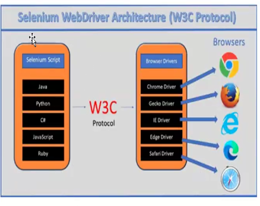
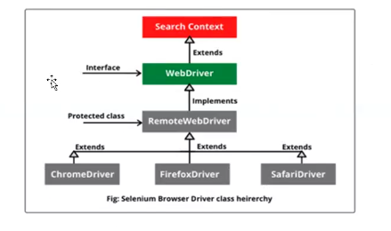

## Introduction on Selenium
Selenium is an open-source framework for automated browser testing and web application automation offering suite of tools to interact with web browsers programmatically

## Different Selenium components
Selenium comprises four components:
1. Selenium IDE
2. Selenium RC
3. Selenium WebDriver
4. Selenium Grid

### Selenium IDE
* Selenium IDE(Integrated Development Environment) is a tool used for automated testing of web applications.
* A browser extension for recording and replay of interactions with a web application.
* With Selenium IDE, you can record user interactions like clicks, typing text, selecting options from dropdown, etc., and then replay them to perform automated tesing.
* It generates test scripts in various programming languages such as Java, Python, C#, etc., which can be further customized and enhanced to suit specific testing needs.
* Selenium IDE is particularly useful for quick test prototyping, creating simple automated tests, and for those who are new to automated testing or programming, as it provides a simple and intuitive interface for test creation.
* However, for more complex testing scenarios and larger test suites, testers often use Selenium WebDriver, which offers more flexibility and control over the testing process.
It works only for chrome and firefox

### Selenium RC ( Remote Control)
It was the predecessor to WebDriver providing a server-based architecture for automated web testing but is now deprecated in favor of WebDriver.

### Selenium Grid
Selenium Grid enables parallel test execution across multiple machines  
and browsers

### Selenium WebDriver
Allows  programmatically interacting with web browsers to automate testing

## Selenium Architecture
Selenium WebDriver API provides communication facility between languages and browsers.  
The following image shows the architectural representation of Selenium WebDriver

### Selenium Language Bindings / Selenium Client Libraries
Selenium 4 supports various programming languages, and developers use Selenium  
client libraries to write automation scripts. Common languages include Java, Python,  
C#, Ruby, and JavaScript.  

### W3C WebDriver Protocol
The WebDriver protocol is the actual communication protocol used between the   client(automation script or test code) and browser driver. It defines how   
commands are sent to the browser, how the browser processes those commands, and   how the results are communicated back to the client  

### Browser Drivers
Each browser (e.g. ChromeDriver, GeckoDriver etc) has its own driver that  
implements the WebDriver protocol. These drivers act as intermediaries between  
the selenium scripts and the browsers, translating commands from the script into actions in the browser.

### Hierarchy of Selenium Webdriver

**SearchContext**  
It is an Interface with 2 Abstract methods - FindElement() and FindElements().

**WebDriver**  
It is an interface which has 11+2 abstract methods  

**RemoteWebDriver**  
It is a protected class which is an implementaion class for webdriver.  
It has 13 concrete methods

**ChromeDriver**  
A WebDriver implementation that controls a Chrome Browser running on the local machine.  
It requires a chromedriver executable to be available in PATH  

**ChromeDriver extends RemoteWebDriver**
# Prerequisites
1. For Windows -  Download Java and Install it. Set the Environment Variables
2. Install Eclipse

## Selenium Installation
Installation of Selenium web driver, making sure all Environmental variables are set and  
installing selenium library in IDE

### How to install Selenium -
1) Download Selenium Webdriver from Official Webisite.
2) Extract Selenium files
3) In Eclipse, Properties of Project => Java Build Path => Libraries  
=> Add external JARS => Select and open all the selenium files that we extracted => Apply and close
4) Download chromedriver(Make sure to download the latest version of chromedriver   
by checking against your chrome version/the chrome version used in your project)
5) We include the chromedriver file path in your script.  

