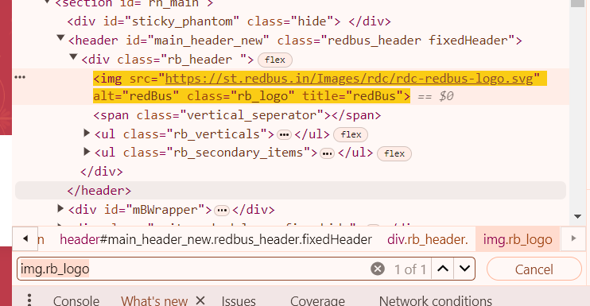

## First Selenium Script:

```
package Day1;
import org.openqa.selenium.chrome.ChromeDriver;
import org.openqa.selenium.WebDriver;

public class OpenBrowserTest {

	public static void main(String[] args) {
		// TODO Auto-generated method stub
		// Mention the driver and it's path
		
		System.setProperty("webdriver.chrome.driver", "C:\\Users\\rudre\\Downloads\\chromedriver122\\chromedriver-win64\\chromedriver.exe");
		// Open my chrome browser => Syntax
		WebDriver driver = new ChromeDriver();
		driver.get("https://www.google.com/");
	}

}
```

### Explanation
1. **System.setproperty** - It is used to enter the details of the driver  
(chromedriver, firefoxdriver,edgedriver) in a key value pair of Setproperty(key,value).  
key is the driver detail, value is the location of the driver  

2. **Web driver** is an **Interface**, driver is the reference variable, new is the keyword,  
ChromeDriver() the Constructor, together a new **ChromeDriver()** object is created and  
stored in the reference variable **driver**.  
Here, All the driver methods are just declared in **Webdriver** Interface, and all the driver methods(get,close,quit,findelement etc) are implemented in Implementation class called **ChromeDriver();**

## Locators

In Automation, before performing any action such as click, pass the data (send keys) we need to find the address of the element.

We do that by inspecting the element
To find the element, we use Locators
Locators are classified into 8 types:
1. ClassName
2. CSS Selector
3. ID
4. LinkText and PartialLink text
5. Name
6. TagName
7. X path.

All of the Locators are static methods of `By` class

By class is an abstract class.

## What is a CSS Selector?
CSS (Cascading Style sheets) Selectors in selenium are used to identify   
and locate web elements based on their id, class, name and other attributes.  

CSS is a preferred locator strategy as it is simpler to write and faster as   
compared to XPath.
**By.cssSelector(String cssSelector)**  method is used to locate the elements   
in Selenium WebDriver.

This method accepts a CSS Selector String as an argument which defines the   
selection method for the web elements. Types of CSS Selectors in Selenium(with Examples)  
There are five types of CSS Selectors tests:
1. ID
2. Class
3. Attribute

#### 1. ID
In CSS, we can use **"#"** notation to select the **"id"** attribute of an element.
```
Syntax:
<tagname>#<id_value>
#<id value>
```

#### 2. Class
In CSS, we can use **"."** notation to select the "class" attribute of an element.

```
Syntax:
<tagname><class value>
<class value>
```
e.g. img.rb_logo


#### 3. Attribute
Apart from "id" and "class", other attributes can also be used to locate web elements using CSS selector.
```
Syntax:
<tagname>[attribute_name='attribute_value']
<tagname>[href='<href value>']
```

```
package day1;

import org.openqa.selenium.By;
import org.openqa.selenium.WebDriver;
import org.openqa.selenium.WebElement;
import org.openqa.selenium.chrome.ChromeDriver;

public class OpenHerokuApp {

	public static void main(String[] args) {
		// TODO Auto-generated method stub
		System.setProperty("webdriver.chrome.driver", "C:\\Users\\rudre\\Downloads\\chromeDriver124-8May\\chromedriver-win64\\chromedriver.exe");
		// Open my chrome browser
		WebDriver driver = new ChromeDriver();
//		driver.get("https://the-internet.herokuapp.com/login");
		
		driver.get("https://rahulshettyacademy.com/AutomationPractice/"); 
		
		// To use locators
		// 1. By ID
//		WebElement username = driver.findElement(By.id("username"));
		
//		2. By Name
//		WebElement username = driver.findElement(By.name("username"));
		
//		3. By ClassName
		WebElement username = driver.findElement(By.className("inputs ui-autocomplete-input"));
		username.sendKeys("some value");
	}

}

```

## Locator Script
```
package day1;

import org.openqa.selenium.By;
import org.openqa.selenium.WebDriver;
import org.openqa.selenium.WebElement;
import org.openqa.selenium.chrome.ChromeDriver;

public class OpenHerokuApp {

	public static void main(String[] args) {
		// TODO Auto-generated method stub
		System.setProperty("webdriver.chrome.driver", "C:\\Users\\rudre\\Downloads\\chromeDriver124-8May\\chromedriver-win64\\chromedriver.exe");
		// Open my chrome browser
		WebDriver driver = new ChromeDriver();
//		driver.get("https://the-internet.herokuapp.com/login");
		
		driver.get("https://rahulshettyacademy.com/AutomationPractice/"); 
		
//		To use locators
//		1. By ID
//		WebElement username = driver.findElement(By.id("username"));
		
//		2. By Name
//		WebElement username = driver.findElement(By.name("username"));
		
//		3. By ClassName
//		WebElement username = driver.findElement(By.className("ui-autocomplete-input"));
//		WebElement username = driver.findElement(By.className("inputs"));
		
//		4. By LinkText
//		driver.findElement(By.linkText("Free Access to InterviewQues/ResumeAssistance/Material")).click();
		
//		5. By PartialLink Text
//		driver.findElement(By.partialLinkText("Free Access")).click();
		
//		6. By CSS Selector
//		a. Without Tagname
//		WebElement username = driver.findElement(By.cssSelector("#username"));
//		WebElement password = driver.findElement(By.cssSelector("#password"));

//		With Tagname
//		WebElement username = driver.findElement(By.cssSelector("input#username"));
//		WebElement password = driver.findElement(By.cssSelector("input#password"));
		
//		b. With class (Rahul Shetty page)  
//		WebElement username = driver.findElement(By.cssSelector(".ui-autocomplete-input"));
//		using Tagname
//		WebElement username = driver.findElement(By.cssSelector("input.ui-autocomplete-input"));

//		c. With Attribute
		WebElement username = driver.findElement(By.cssSelector("input[placeholder='Type to Select Countries']"));
		
		
		username.sendKeys("some value");
//		password.sendKeys("wrong password");
	}

}

```