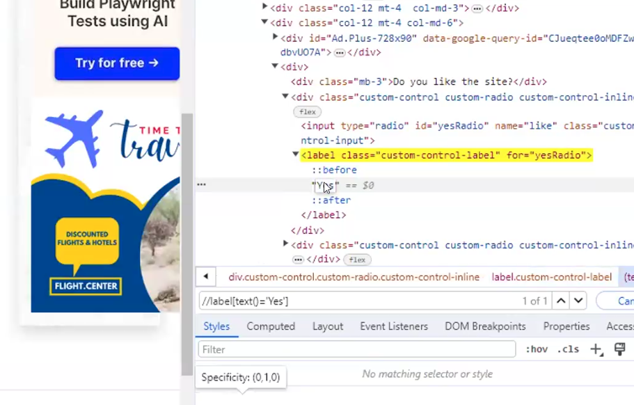
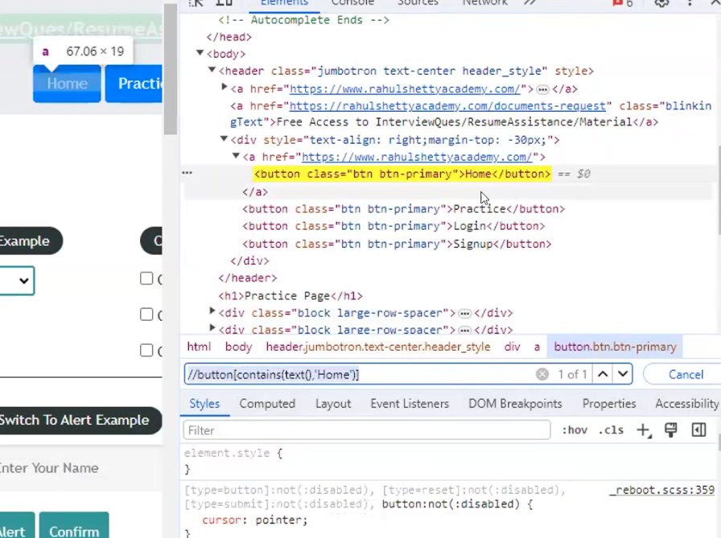
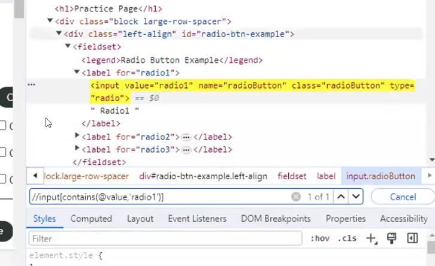
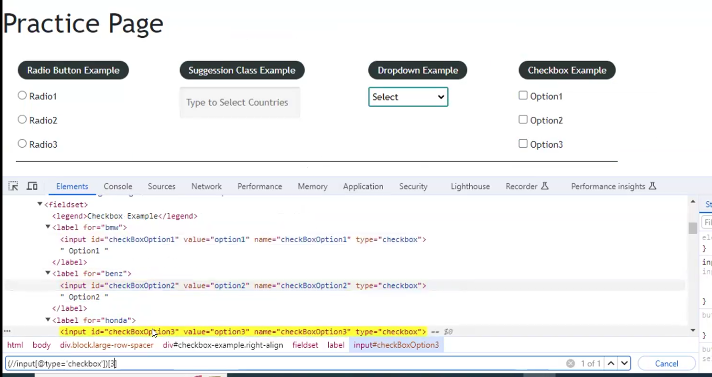

# Locators Practice
## Website - https://www.redbus.in/
1. CSS Locator - ID  
li#bus_tickets_vertical  
li#rail_tickets_vertical  
div#onwardCal  
button#search_button  
li#user_sign_in_sign_up

2. CSS Locator - Class  
img.rb_logo  
li.rb_vertical  
li.rb_vertical:nth-child(1)  
li.rb_vertical:nth-child(2)  
div.rb_main_secondary_item.link  
div.sc-bdVaJa.bpEJck  
div.sc-bdVaJa.fpFLOj  
li.header_dropdown_item:nth-child(3)  
i.sc-bwzfXH

3. CSS Locator - Attribute  
a[href="https://www.redbus.in/info/OfferTerms"]  
a[href="https://www.redbus.in/online-booking/rtc-directory"]  
img[title="Online Bus Tickets Booking"]
img[src="https://st.redbus.in/web/images/layout/rail_vertical.svg"]  
li[data-text="Cancel Ticket"]  
li[data-text="Change Travel Date"]  
li[data-text="Login/ Sign Up"]

# X Path
It is path of the element in the HTML Tree structure  

Xpath Syntax - //Tagnam[@key="Value"];

Xpath example - //input[@id='username']

There are two kinds of Xpath - 
1. Absolute Xpath - only Forward slash - used to navigate to parent to immediate child tag  
e.g. heroku => `/html/body/div[2]/div/div/form/div[1]/div/input`

2. Relative Xpath -   
Double forward slash - Used to travel directly to the specified tag
We can also use combination of Relative and Absolute xpaths.

**How to write Xpath with Multiple attributes.**  
Using 'and' operator  
Example - //input[@class='nav-input nav-progressive-attribute' and @type='text']  
Example - //input[@name='username']

**How to use Text Function in Xpath -**   
Syntax:  
//tagname[text()='Text Value']
Example in Gmail SigninPage :  
//Span[text()='Create account']  

**How to write Xpath using Indexing -**   
Syntax - (//tag[@attribute='Value'])[index]  

Contains Function :  
It takes two parameters.
Syntax - 
//Tag[contains(text(),'textvalue')]  

Example -  
(//div[@class="_fluid-quad-image-label-v2_style_fluidQuadImageLabelBody__3tld0"]//img)[3]

//a[contains(text(),'Grocery')]  
//*[contains(text(),'Forgot')]

