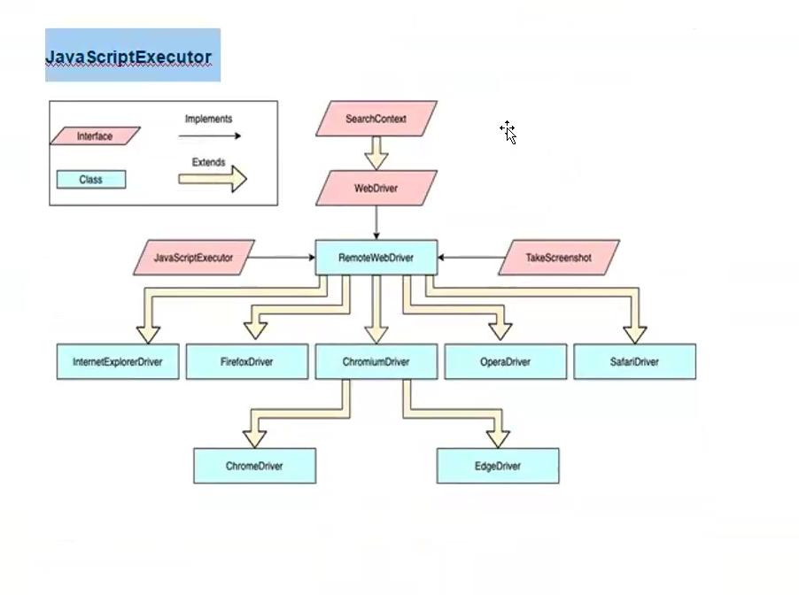

# Why do we need waits?

**What is Synchronization** - Synchronization in Selenium refers to handling the timing issues between the test script   
execution and the web application’s response. It ensures that Selenium WebDriver waits for the   
required elements or events before performing actions, preventing errors like   
**ElementNotVisibleException,** **StaleElementReferenceException,** or **NoSuchElementException.**

## Wait Commands

**What are Wait commands in Selenium?**  
The wait commands are essential when it comes to executing Selenium tests.   
They help to observe and troubleshoot issues that may occur due to variation in time lag  
While running Selenium tests, it is common for testers to get the message **Element Not  
Visible Exception**. This appears when a particular web element with which has to  
interact, is delayed in its loading. To prevent this Exception, Selenium Wait Commands must  
be used.  

In automation testing, Selenium WebDriver wait commands direct test execution to pause  
for a certain length of time before moving onto the next step. This enables WebDriver to  
check if one or more web elements are present/visible/enriched/clickable, etc when  
identifying certain elements. If an element is not located, then the  
appears. Selenium Wait commands help resolve this  
issue.  
Important point — When the element is actually but there is a browser  
delay issue.

## 1. Implicit Wait(Global Wait)

Implicit Wait directs the Selenium to wait for a certain measure of time before  
throwing an exception. Once this time is set, will wait for the element before the  
exception occurs.  
**It sets a global wait for a certain amount of time for the entire script.** Selenium will wait for a  
specified amount of time before throwing a if an element is not  
present  
Once the command is run, Implicit Wait remains forthe entire duration for which the browser  
is open. default setting is 0, and the specific wait time needs to be set by the following  
protocol.  

**Limitation:** It applies globally and may cause unnecessary waiting.  

**Implicit Wait Syntax**  

`driver.manage().timeouts().implicitlyWait(Duration.ofSeconds(10));`

```java
ImplicitWaitTest

package day4;

import java.util.concurrent.TimeUnit;

import org.openqa.selenium.By;
import org.openqa.selenium.WebDriver;
import org.openqa.selenium.chrome.ChromeDriver;

public class ImplicitWaitTest {

	@SuppressWarnings("deprecation")
	public static void main(String[] args) throws InterruptedException {
		// TODO Auto-generated method stub
		System.setProperty("webdriver.chrome.driver", "C:\\Users\\rudre\\Downloads\\chromeDriver124-8May\\chromedriver-win64\\chromedriver.exe");
		WebDriver driver = new ChromeDriver();
//		Thread.sleep(10000);
//      Thread.sleep(10000) will definately wait for 10 seconds irrespective of whether u are getting the element or not.
		// Implicit wait
		driver.manage().timeouts().implicitlyWait(10,TimeUnit.SECONDS);
		driver.get("https://rahulshettyacademy.com/AutomationPractice/");
		
//		driver.findElement(By.cssSelector("input[placeholder='Type to Select Countries']")).sendKeys("some country");
		driver.findElement(By.cssSelector("input[placeholder='Type to ']")).sendKeys("some country");
		driver.findElement(By.xpath("//a[@href='https://rahulshettyacademy.com/documents-request']")).click();
	}
}

```

## 2. Explicit wait(Conditional Wait)

**Explicit Wait in Selenium**  

* By using the Explicit Wait command, the WebDriver is directed to wait until a **certain  
condition occurs** before proceeding with executing the code. 

Setting Explicit Wait is important in cases where there are certain elements that  
naturally take more time to load. If one sets an implicit wait command, then the  
browser will wait for the same time frame before loading **every web element**. This  
causes an unnecessary delay in executing the test script.  

Explicit wait is more intelligent, but can only be applied for specified elements.    
However, it is an improvement on implicit wait since it allows the program to pause
for dynamically loaded Ajax elements.  

**Advantage:** More efficient than implicit wait as it applies only where needed.

In order to declare explicit wait, one has to use ExpectedConditions. The following  
**Expected Conditions** can be used in Explicit Wait.  

1. alertIsPresent()
2. elementSelectionStateToBe()
3. elementToBeClickable()
4. elementToBeSelected()
5. frameToBeAvailableAndSwitchToIt()
6. invisibilityOfTheElementLocated()
7. invisibilityOfElementWithText()
8. presenceOfAllElementsLocated()
9. presenceOfElementLocated()
10. textToBePresentInElement()
11. textToBePresentInElementLocated()
12. textToBePresentInElementValue()
13. titles()
14. titleContains()
15. visibilityOf()
16. visibilityOfAllElements()
17. visibilityOfAllElementsLocatedBy()
18. visibilityOfElementLocated()

* Syntax
WebDriverWait wait = new WebDriverWait(driver,30);

```java
ExplicitWaitTest.java

package day4;

import java.time.Duration;

import org.openqa.selenium.By;
import org.openqa.selenium.WebDriver;
import org.openqa.selenium.WebElement;
import org.openqa.selenium.chrome.ChromeDriver;
import org.openqa.selenium.interactions.Actions;
import org.openqa.selenium.support.ui.ExpectedCondition;
import org.openqa.selenium.support.ui.ExpectedConditions;
import org.openqa.selenium.support.ui.FluentWait;
import org.openqa.selenium.support.ui.WebDriverWait;

public class ExplicitWaitTest {
public static void main(String[] args) {
// TODO Auto-generated method stub
System.setProperty("webdriver.chrome.driver", "C:\\Users\\rudre\\Downloads\\chromeDriver124-8May\\chromedriver-win64\\chromedriver.exe");
WebDriver driver = new ChromeDriver();

// Step1 - Create object of WebDriverWait
WebDriverWait wait = new WebDriverWait(driver,Duration.ofSeconds(10));
driver.get("https://www.ebay.com/");


// Step2 - Make use of until method and expected conditions
// Step3 - We will mention the condition in ExpectedConditions
wait.until(ExpectedConditions.urlToBe("https://www.ebay.com/"));

// What happens in the above line?
// It will compare the mentioned to the URL that is loaded inside the browser.
// If the URL matches then it will not make it wait, it will allow the execution smoothly.
// What if the URL is wrong? It will make it wait for specified time and then throw the Exception.


driver.manage().window().maximize();
// Creating an object of Actions class.

Actions act = new Actions(driver);
WebElement electronics_link = driver.findElement(By.linkText("Electronics"));
electronics_link.click();
	}
}
```

## 3. Fluent Wait (Polling-based Wait)

* It checks for an element at regular intervals until the condition is met or timeout occurs.
* Useful for elements that appear at irregular intervals.

```java
FluentWait<WebDriver> wait = new FluentWait<>(driver)
    .withTimeout(Duration.ofSeconds(30))
    .pollingEvery(Duration.ofSeconds(5))
    .ignoring(NoSuchElementException.class);

WebElement element = wait.until(ExpectedConditions.presenceOfElementLocated(By.id("example")));
```

⚡ **Advantage:** Helps in handling dynamically changing elements.


## 4. Thread.sleep() (Hard Wait)

* It forces WebDriver to pause for a specific time before executing the next step.
* Example - `Thread.sleep(5000);`
* ⚡ **Disadvantage:** Inefficient, as it may wait longer than required.


## Table

| Feature              | Implicit Wait                        | Explicit Wait                          |
|----------------------|--------------------------------------|----------------------------------------|
| **Definition**       | Waits for a specified time for elements to appear globally | Waits for specific conditions for specific elements |
| **Scope**            | Applies to all elements globally     | Applies to specified elements and conditions |
| **Setting**          | One-time global setting              | Defined each time for specific elements |
| **Conditions**       | Only waits for the presence of elements | Can wait for various conditions like visibility, clickability, etc. |
| **Control**          | Less control over wait conditions    | More control and flexibility with wait conditions |
| **Typical Usage**    | Handling unpredictable delays        | Handling specific scenarios requiring certain conditions |


**Example Use Cases**  
Implicit Wait: Best used when you have many elements that may load at different times,   
but you don't need to check specific conditions.

Explicit Wait: Best used when you need to wait for specific conditions such as an element   
becoming clickable, visible, or containing a certain text.

### JavaScript Executor

 

In simple words, JavaScript Executor is an interface that is used to execute  
JavaScript with Selenium.  
To simplify the usage of JavaScript Executor in selenium, think of it as a medium that  
enables the to interact with HTML elements within the browser.  
JavaScript is a programming language that interacts with HTML in a browser, and to  
use this function in Selenium, is required.  

```java
importing the package

Import org.openqa.selenium.JavaScriptExecutor;

// Creating a reference

JavascriptExecutor js = (JavascriptExecutor) driver;

// calling the method
js.executeScript(script, args);
```

### How JavascriptExecutor works in Selenium

The JavaScript Executor in Selenium is an interface that provides a way to execute JavaScript code within the  
context of the browser. It is particularly useful for performing operations that might not be directly supported  
by Selenium WebDriver's API or for interacting with elements in ways that are more efficient or reliable than  
standard WebDriver commands.  

Let's try to understand the working of JavascriptExecutor using a simple example and implementation of   
both the JavascriptExecutor methods.

1. JavascriptExecutor in Selenium to click a buton
js.executeScript("document.getElementByID('elementid').click();");

2. JavascriptExecutor in Selenium to send text
js.executeScript("document.getElementByID('elementid').value='xyz'");

3. JavascriptExecutor in Selenium to scroll down.
js.executeScript("window.scrollBy(0,250)","");

4. JavascriptExecutor in Selenium to scroll down until the element is found into view

// Scrolling down the page till the element is found
js.executeScript("arguments[0].scrollIntoView();",Element);

```java

JavaScriptExecutorTest.java

package day4;

import org.openqa.selenium.By;
import org.openqa.selenium.JavascriptExecutor;
import org.openqa.selenium.WebDriver;
import org.openqa.selenium.WebElement;
import org.openqa.selenium.chrome.ChromeDriver;

public class JavaScriptExecutorTest {

public static void main(String[] args) {
// TODO Auto-generated method stub
System.setProperty("webdriver.chrome.driver", "C:\\Users\\rudre\\Downloads\\chromeDriver124-8May\\chromedriver-win64\\chromedriver.exe");
WebDriver driver = new ChromeDriver();
driver.get("https://rahulshettyacademy.com/AutomationPractice/");
driver.manage().window().maximize();
WebElement option1 = driver.findElement(By.cssSelector("input[name='checkBoxOption1']"));
option1.click();

WebElement mousehover = driver.findElement(By.id("mousehover"));

//Step1 - Invoke JavaScript Executor
JavascriptExecutor js = (JavascriptExecutor)driver;
//js.executeScript("window.scrollBy(0,1300)");

js.executeScript("arguments[0].scrollIntoView()", mousehover);
}
}

```


```java
EbayScrollTest.java

package day4;

import org.openqa.selenium.By;
import org.openqa.selenium.JavascriptExecutor;
import org.openqa.selenium.WebDriver;
import org.openqa.selenium.WebElement;
import org.openqa.selenium.chrome.ChromeDriver;

public class EbayScrollTest {

	public static void main(String[] args) {
		// TODO Auto-generated method stub
		System.setProperty("webdriver.chrome.driver", "C:\\Users\\rudre\\Downloads\\chromeDriver124-8May\\chromedriver-win64\\chromedriver.exe");
		WebDriver driver = new ChromeDriver();
		driver.get("https://www.ebay.com/");
		driver.manage().window().maximize();
		WebElement Register_link = driver.findElement(By.linkText("Registration"));
		
//		Step1 - Invoke javascript executor
		JavascriptExecutor js = (JavascriptExecutor)driver;
//		Step2 - Use executemethod from js and use
		js.executeScript("arguments[0].scrollIntoView()", Register_link);
		
	}

}


```


