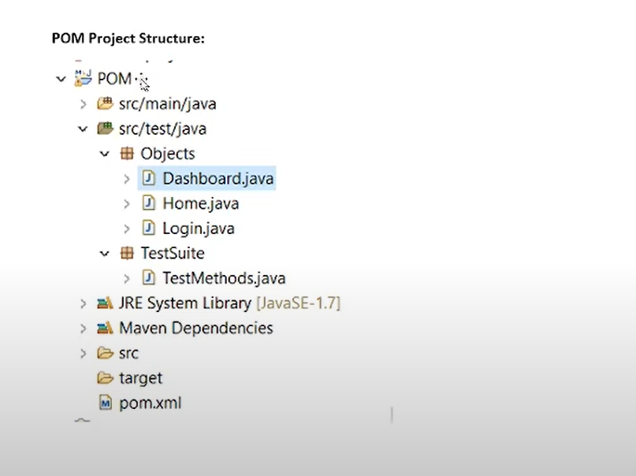
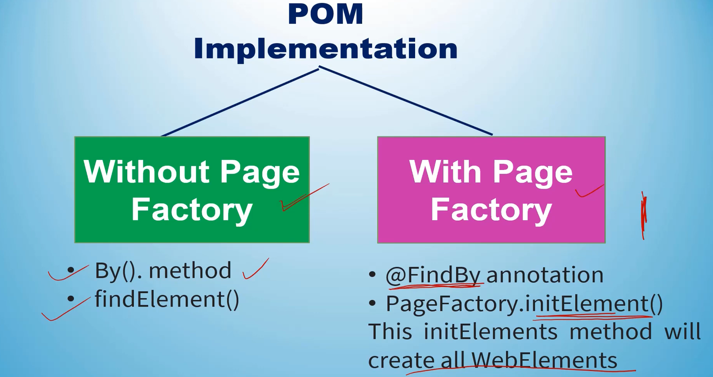

# POM - Page Object Model

Video Link - https://www.youtube.com/watch?v=1zVoBhFLOTY&list=PLAkEcrdilZ4nhGjwZTSHYV3Xo6xuIckzk&index=1

Page Object Model, also known as POM, is a **design pattern** in Selenium that creates an  
object repository for storing all web elements.   
It is useful in reducing code duplication and improves  
test c.ase maintenance.  

Io simplify, in the Page Object Model framework, we create a class file for each web page.  

This class file consists or different web elements present on the web page. Moreover, the test scripts  
then use these elements to perform different actions.  

> This POM design pattern can be used with any framework like TestNG, Cucumber or any Hybrid Model which you are using.

> In the above image we have two packages Objects and TestSuite.

## Advantages:

1. It makes code maintainable.
2. It makes readable i.e. the readability increases.
3. It makes code reusable.
    * We update to a class file. We no need to update the test cases.
4. It makes code easy to update the test scripts/Element location.

# POM - tutorial 2 
https://www.youtube.com/watch?v=n6TasynCP1k&list=PLnNg6KqJ3HGh8K2KhCCxraHh09L3LPL4E&index=39

