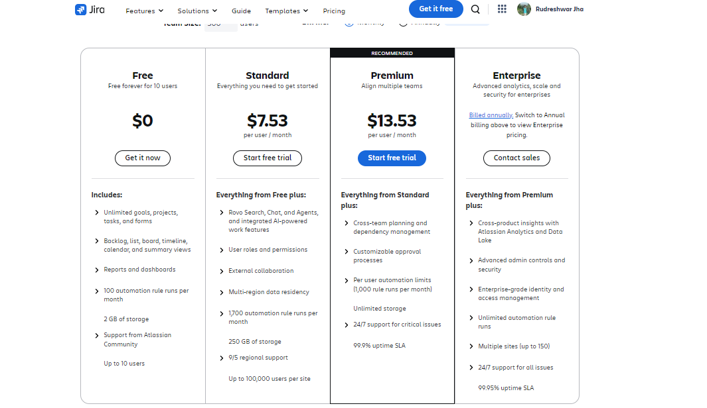

# Jira
* Work Management Tool
* Managing projects, bug tracking, issue tracking

# Atlassian Tools
* Plan & Track
  * Jira Software
    * Jira Core
    * Jira Align
* Support
  * Jira Service Desk
    * Status Page
    * Opsgenie
* Collaborate
  * Confluence
    * Trello
* Code & Build
  * Bitbucket
  * Sourcetree

# Why Jira
* Fully Customizable
* Countless Apps to further enhance functionality

# Jira Platforms
* Cloud
  * Fast Start-up
  * No maintenance
  * Monthly or annual subscription
* Server
  * Self-installed and managed
  * One-time installation fee + ongoing support fees
  * Local data
  * More customizability
* Data Center
  * Same as Server, but at scale
  * Enterprise level security, availability, performance

* In this course we will be using Jira Cloud

## Jira Cloud Subscription Tiers
* Free
* Standard
* Premium
* Enterprise

Reference - https://www.atlassian.com/software/jira/pricing

## Course Structure
* Intro Section
* Agile Concepts with Jira
* Working with an agile team with Jira
* Managing an agile team with Jira
* Jira administration
* Team-Managed Projects
* Bonus Sections
* Confluence