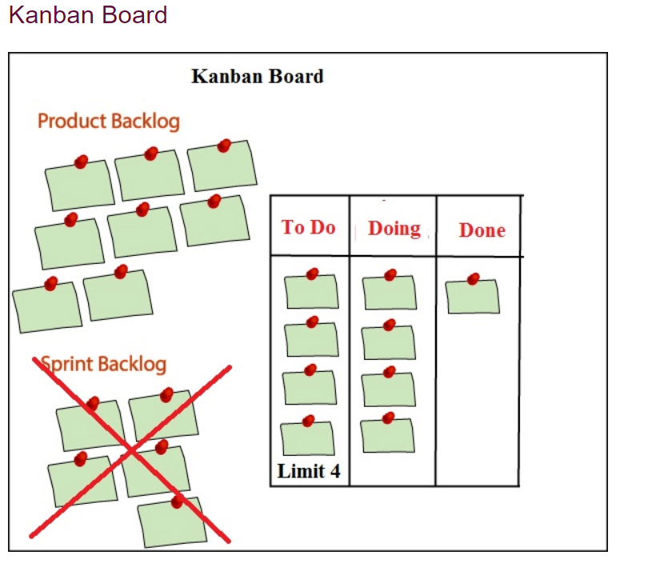

# Kanban Methodology

Kanban is the most popular agile framework after Scrum for software development.   
It provides the real-time and transparency of work. In Kanban board, all the tasks   
are visible that allows the team members to see the state of every task at any time.

## Characteristics of Kanban Methodology

1. Flexibility
2. Minimize time cycles
3. Visual metrics
4. Continuous delivery

Kanban board is a tool used to visualize the work and limit work-in-progress.  

As in scrum, we are taking some activities from a product backlog and adding in   
a sprint backlog. However, in Kanban, we do not have sprint, so sprint backlog   
activity will not be performed. This is the main difference between scrum and   
Kanban that scrum contains sprint backlog while kanban does not contain the sprint   
backlog.

## Kanban board consists of three states:
* To Do
* Doing
* Done

When the project is started, then we put all the activities from the product backlog   
to the 'To Do' state. When the team member starts working on an activity, then that activity   
is put in a 'Doing' state, and when the activity is placed, then it is placed in a 'Done' state.

From the Kanban board, one can get to know which activities have been done and which activities   
they need to develop.

One of the most important features of the Kanban board is a Limit option. In the above figure,   
we have eight tasks in a product backlog and limit set is 4. At a time, it will take only four   
tasks in a 'To Do' state, and if any of the tasks come in a 'Doing' state, then one more task   
from the product backlog will be placed in a 'To Do' state. In this way, we can set the limit   
depending on the availability of the resources.