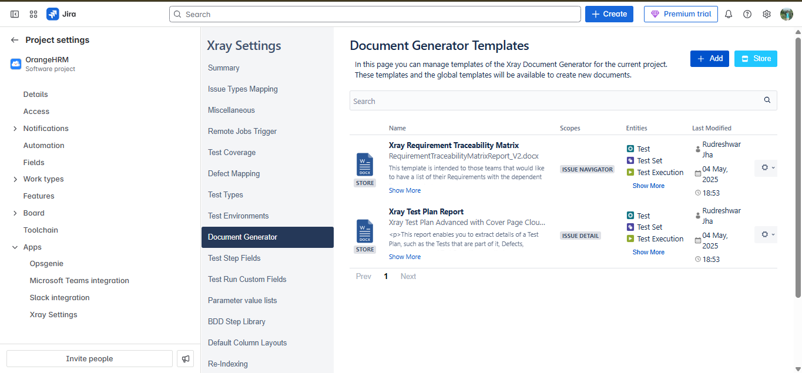

# Building Tests in Xray
Screenshot -

 

 

 ## Calling a Test and Test Step

 

 ## Creating a Pre-condition

 

 ## Test Execution in Xray

 

 ## Using parameters in a test

 

 ## Parameterizing in Xray

 ## Test Management in Xray

 

 ## Test Plan in Xray

 ## Test Repository in Xray
The X ray gives you the freedom
of managing your work into systematic manner, organizing them
into folders, putting them together with a certain expectations or
certain objectives
But same thing, if being done with Excel sheets, you may have any
number of Excel sheets within a workbook, or you can have many
number of workbooks which could be lying here and there in
different folders within your file explorer. 

 

 ## Defect mapping in xray
Defect mapping" defines how Xray recognizes and handles defects — like, what Jira issue types should be considered "defects" and how they should be linked to tests.

 

 ## Reports in Xray

* Test Executions List
* Test Plans List
* Test Runs List
* Test Sets List
* Test List
* Test coverage
* Test plans Metrics
* Traceability

## Dashboard in Xray

* Creating Dashboard
* Adding Gadgets
* Publishing Dashboard

## Document Generator
* Setting up Template
* Generating Documents
* Viewing Document Reports

Install from store

Document generator
